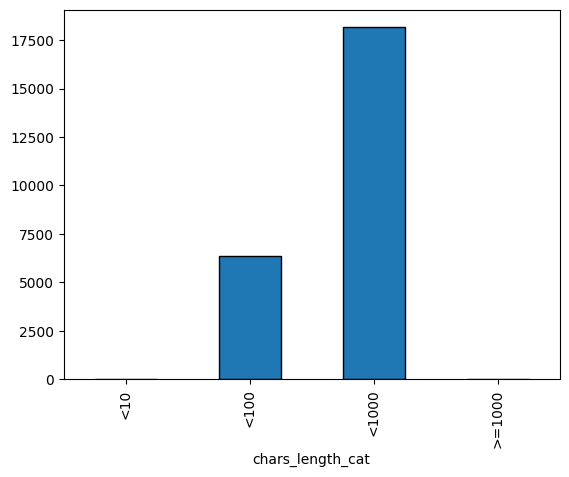
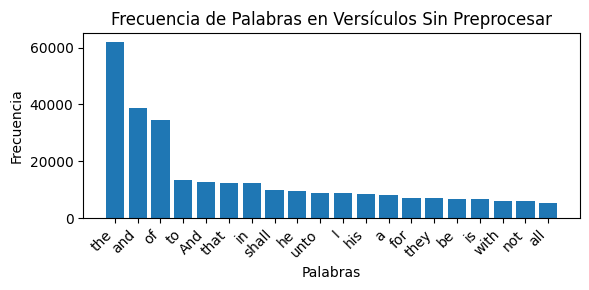
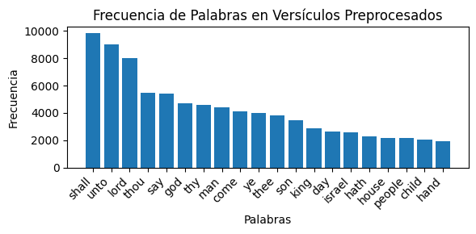

# Reporte de Datos

Este documento contiene los resultados del análisis exploratorio de datos.

## Resumen general de los datos

Datos clave de nuestro corpus

- Nuestro corpus es el antigüo testamento de la Biblia. Específicamente la versión King James (KJV).
- Al ser esta una versión anglosajona de la biblia, nuestro corpus está completamente en idioma inglés.
- Un Documento para nosotros es un versículo de la Biblia.
- El tamaño del corpus es 4.22 MB.
- Nuestro corpus contiene, inicialmente y sin preprocesamiento adicional, 24.606 documentos.
- Todos los documentos tienen una relación ya que pertenecen al mismo texto. 
- Adicionalmente están organizados de forma secuencial de forma que componen una estructura más grande.

## Resumen de calidad de los datos

- En un principio No hay datos faltantes, además los datos vienen de Kaggle, que garantiza cierta calidad de los datos.
- El número de documentos de nuestro corpus que cambia al codificarlo con unidecode es: 1,724. El principal caracter que hace que al codificarlo cambie es el símbolo <’>.
- Dado que la Biblia fue completamente traducida en inglés no hay mezcla de idiomas.

## Variable objetivo 
Para el trabajo que estamos realizando (como se trata es de identificación de entidades) no existe una variable objetivo per se. Se podría pensar que la "variable objetivo" sería el conjunto de entidades dentro del texto que se va a procesar.

## Variables individuales 
Una de las variables que podemos obtener con el corpus es el la longitud de cada uno de los versos de acuerdo al número de caracteres.

Con la gráfica podemos observar que la distribución en la gran mayoría de los documentos tienen del orden de centenas de caracteres (entre 100 y 1000). Algunos, del orden de decenas (entre 10 y 100). Y solo unos cuantos tienen o menos de 10 o más de 1000.

Otro análisis interesante que se puede hacer es ver la importancia del preprocesamiento de los datos. En las siguientes dos imágenes se pueden ver cómo cambia el top 20 de palabras con más apariciones en el corpus antes y después de preprocesar.
Si no se hace preprocesamiento, las palabras con más repetición serán aquellas que el lenguaje natural utiliza como auxiliares (pronombres, conjunciones, contracciones, etc).
Luego de preprocesar se puede ver cómo el top cambia y ahora aparecen palabras con mayor significado.

## Ranking de Variables
Como no es necesario una reducción dimensional, no se hizo PCA ni se hizo un ranking de variables.
