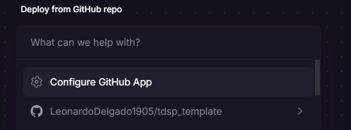
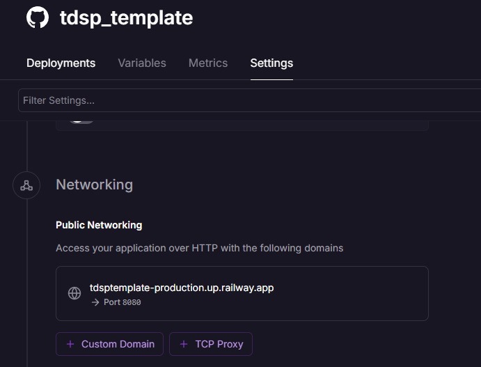

# Despliegue de modelos

## Infraestructura

- **Nombre del modelo:** Keyed Vector Bible
- **Plataforma de despliegue:** La plataforma elegida para el despliegue es [Railway](https://railway.app)
- **Requisitos técnicos:**
  + Versión de python: 3.10.0
  + todas las librerías listadas en el archivo `requirements.txt`
- **Requisitos de seguridad:** Por el alcance del proyecto y teniendo en cuenta que la Biblia es un documento público, no se realizó ningun filtro de seguridad para acceder a los datos
- **Diagrama de arquitectura:** [TODO]

## Código de despliegue

- **Archivo principal:** `railway.json` y `main.py`
- **Variables de entorno:** NA

## Documentación del despliegue

- **Instrucciones de instalación:** (instrucciones detalladas para instalar el modelo en la plataforma de despliegue)
Para hacer la instalación en la plataforma de despliegue (Railway) el único paso necesario es solo se necesita conectarlo con la cuenta de GitHub donde está alojado el código fuente (se pude hacer un fork del proyecto)

- **Instrucciones de configuración:** (instrucciones detalladas para configurar el modelo en la plataforma de despliegue)
Gracias a que las instrucciones de configuración se encuentran en el archivo `railway.json` no es necesario ningún paso adicional para que la plataforma empieze a desplegar.
- **Instrucciones de uso:** (instrucciones detalladas para utilizar el modelo en la plataforma de despliegue)
Para poder tener acceso público a la API que se publicó, en la plataforma hay que entrar a la ejecución de despliegue, hacer click en settings y _Generate domain_
- **Instrucciones de mantenimiento:** (instrucciones detalladas para mantener el modelo en la plataforma de despliegue)
Teniendo en cuenta que la Biblia, al ser un libro Religioso y Canónico, no se espera que cambien los datos y por ende que no sea necesario a priori un ajuste sobre el modelo que se presenta.

  Ahora bien, siempre que se quiera mejorar el modelo, se debe cambiar el archivo `keyed_vector_bible.kvmodel` ya que allí estan almacenados los valores del modelo. Una vez actualizado y subidos los cambios al repositorio, la plataforma Railway automáticamente detectará el cambio y hará el nuevo despliegue